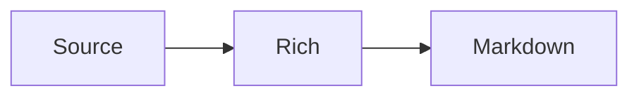

# Long Mixed Note

This note mixes **bold**, *italic*, `code`, ~~strike~~, a [link](https://example.com), 中文, and emoji 🚀.

## Tasks and lists

- plain item
- [ ] first task
- [x] completed task
- final plain item

3. ordered start
4. ordered continuation
5. ordered finish

> A quoted paragraph.
>
> - nested quote item
> - another item

## Table

| Feature | 状态 | Detail |
| --- | --- | --- |
| Lists | 完成 | mixed task/plain |
| Math | 完成 | inline and block |
| Images | 测试 | vault relative |

## Code and diagrams

```javascript
const answer = 42;
console.log(answer);
```



## Math

Inline $E = mc^2$ and $a_b$.

$$
\int_0^1 x^2\,dx
$$

## Images and preserved syntax


Raw key: <kbd>Cmd</kbd>.

A [reference][ref] and footnote.[^1]

[ref]: https://example.com/reference

[^1]: Footnote content with 中文.

## Repeated prose

Paragraph 01 keeps ordinary text stable across normalization.

Paragraph 02 keeps ordinary text stable across normalization.

Paragraph 03 keeps ordinary text stable across normalization.

Paragraph 04 keeps ordinary text stable across normalization.

Paragraph 05 keeps ordinary text stable across normalization.

Paragraph 06 keeps ordinary text stable across normalization.

Paragraph 07 keeps ordinary text stable across normalization.

Paragraph 08 keeps ordinary text stable across normalization.

Paragraph 09 keeps ordinary text stable across normalization.

Paragraph 10 keeps ordinary text stable across normalization.

Paragraph 11 keeps ordinary text stable across normalization.

Paragraph 12 keeps ordinary text stable across normalization.

Paragraph 13 keeps ordinary text stable across normalization.

Paragraph 14 keeps ordinary text stable across normalization.

Paragraph 15 keeps ordinary text stable across normalization.

Paragraph 16 keeps ordinary text stable across normalization.

Paragraph 17 keeps ordinary text stable across normalization.

Paragraph 18 keeps ordinary text stable across normalization.

Paragraph 19 keeps ordinary text stable across normalization.

Paragraph 20 keeps ordinary text stable across normalization.
