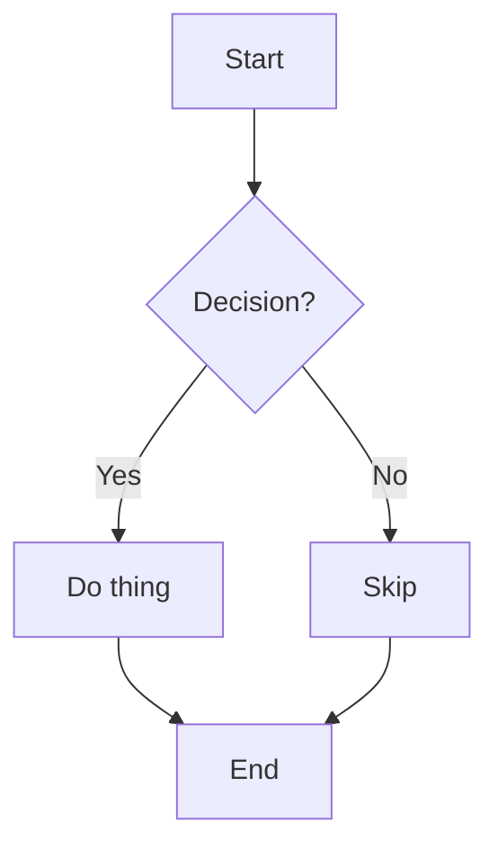
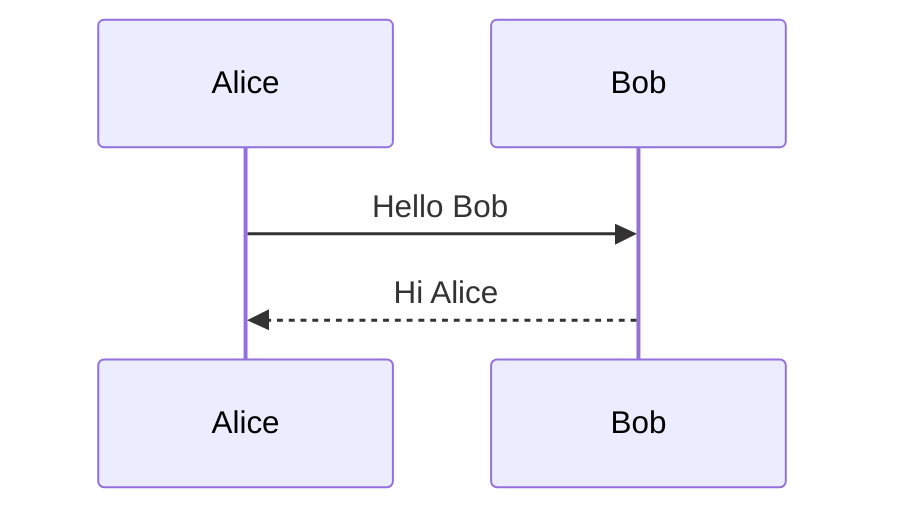

# Manual Test Checklist  
  
Use this checklist before sharing the app with another person.  
  
## App startup  
  
- [ ] App starts from development mode  
- [ ] Packaged app starts  
- [ ] No immediate crash on launch  
  
## Vault workflow  
  
- [ ] Vault can be selected  
- [ ] Demo vault can be created  
- [ ] Existing notes appear  
- [ ] Note selection works  
  
## Note editing  
  
- [ ] New note can be created  
- [ ] Existing note can be edited  
- [ ] Save works  
- [ ] Saved note remains visible  

## Dirty state and draft survival

- [ ] Create a new draft — note list shows "Draft" badge
- [ ] Edit a vault note — status bar shows "Draft" indicator
- [ ] Switch to a different note while a draft is dirty, then switch back — content is preserved
- [ ] Load a new vault while a draft exists — draft survives and appears in the Drafts filter

## Filename collision guard

- [ ] Create a draft whose title matches an existing vault filename → Save is blocked with an error toast; no file is overwritten
- [ ] Create two drafts with the same title → Save All & Quit is blocked with an error toast; neither is saved

## Editor mode (CM6 / Hybrid)

- [ ] Default write surface is hybrid-cm6 (live-styled Markdown) — Stage 17 flip
- [ ] `?writeEngine=cm6` fallback engine still loads CodeMirror 6 styled-source mode
- [ ] Undo and redo work correctly in CM6 mode
- [ ] Chinese IME composition does not drop the first character in CM6 mode
- [ ] Append `?writeEngine=hybrid` to the dev URL → Hybrid write view loads instead
- [ ] Hybrid Preview renders Markdown correctly

## Task-toggle behavior (Stage 23, hybrid-cm6 only)

Default engine is `hybrid-cm6`. Open a note containing
`- [ ] one\n- [x] two\n- [X] three\n`.

- [x] Primary-click the `[ ]` marker → toggles to `[x]`; click again → back to `[ ]`
- [x] Primary-click the `[X]` marker → toggles to `[ ]`
- [x] Primary-click on the label text (not the marker) → only caret movement; no toggle
- [x] Primary-click on the bullet `-` → only caret movement; no toggle
- [x] Right-click on the marker → no toggle
- [x] Middle-click on the marker → no toggle (skip if no middle-click affordance)
- [x] `Cmd-click`, `Ctrl-click`, `Alt-click`, `Shift-click` on the marker → no toggle (modifier keys are reserved)
- [x] Place caret on a task line, press `Cmd-Shift-X` (macOS) → toggles that line's marker
- [x] Place caret on a non-task line, press `Cmd-Shift-X` → no change, no error
- [x] **Dirty badge appears** in the title bar after any toggle. Stop and investigate if the badge does not update
- [x] Active selection across multiple lines including a task line → press `Cmd-Shift-X` → toggles only the line containing the primary caret; selection preserved
- [x] Begin Chinese / Japanese / Korean IME composition on a task-line label; click another task marker mid-composition → no toggle; composition completes normally on commit
- [x] `Cmd-Z` undoes the last toggle in one step; `Cmd-Shift-Z` redoes
- [x] Save the note, close it, reopen → marker state is **character-identical after LF normalization** with what the editor showed before save
- [x] Long-document responsiveness: open a note with 200+ task markers, click any one → toggle feels instant (< 100 ms perceptually)
- [x] Preview pane (Toast UI) reflects the toggled state after the existing Write→Preview sync
- [x] Switch to `?writeEngine=cm6` fallback → task markers are NOT clickable; no error
- [x] Switch to `?writeEngine=hybrid` legacy fallback → no toggle behavior; no error
- [x] No new console warnings or errors during any of the above

Tester: liyunhui  Date: 2026-05-14  OS: macOS

## Search  
  
- [ ] Search finds matches in title  
- [ ] Search finds matches in body  
- [ ] Search finds matches in tags  
- [ ] Search finds matches in source  
- [ ] Search snippets are visible  
  
## Filters  
  
- [ ] All Notes filter works  
- [ ] AI Imports filter works  
- [ ] Drafts filter works  
- [ ] Vault Files filter works  
  
## Metadata  
  
- [ ] Frontmatter tags display correctly  
- [ ] Frontmatter source displays correctly  
  
## MCP ingest  
  
- [ ] `npm run smoke` passes  
- [ ] Claude Code can call `ingest_chat_markdown`  
- [ ] Codex can call `ingest_chat_markdown`  
- [ ] Ingested file is written into `Inbox/AI Chats/YYYY/MM/`  
- [ ] App auto-refreshes after ingest  
- [ ] New imported note appears in AI Imports  
  
## Delete behavior  
  
- [ ] Draft delete works  
- [ ] File-backed delete works safely  
  
## Close warning (Stage 6.3A)

- [ ] Clean state, click window close button → app closes, no dialog
- [ ] Clean state, Cmd+Q (macOS) → app quits, no dialog
- [ ] Type into a new draft, click window close button → warning dialog appears
- [ ] Warning: Cancel keeps the app open and the draft intact
- [ ] Warning: Discard & Quit closes the app (draft is intentionally lost)
- [ ] Edit a vault note, Cmd+Q → warning dialog appears
- [ ] Cancel from the warning leaves the dirty vault note still dirty (Draft status)
- [ ] Untouched "Untitled note" draft does NOT trigger the warning

## Save All & Quit (Stage 6.3B)

- [ ] Dialog shows three buttons: Save All & Quit, Discard & Quit, Cancel
- [ ] Default button (Enter) is Save All & Quit
- [ ] Esc / dialog dismiss → Cancel (app stays open)
- [ ] Edit one vault note, Save All & Quit → file saves, app quits
- [ ] Edit one new draft (with a real title), Save All & Quit → draft saves under derived filename, app quits
- [ ] Mixed dirty drafts + dirty vault notes, Save All & Quit → all save, app quits
- [ ] Edit a draft pre-vault, Save All & Quit → OS folder picker opens; pick a folder → save proceeds, app quits
- [ ] Edit a draft pre-vault, Save All & Quit → cancel the OS picker → app stays open, draft still dirty
- [ ] Two new drafts with the same title → Save All & Quit aborts on the conflict, error toast, app stays open
- [ ] File-permission error during save → Save All & Quit aborts, error toast, app stays open
- [ ] Discard & Quit (regression) still works alongside Save All
- [ ] Cancel (regression) still keeps the app open

## Packaging  
  
- [ ] Local packaged app artifact exists  
- [ ] Unsigned app opens after running: `codesign --force --deep --sign - dist/mac-arm64/markdown-vault-desktop.app`  
  
## Visual appearance (Stage 7.1 baseline)

- [ ] Editor surface, title input, and empty-note hint render with the warm-paper token palette — no pure-white or pure-black areas
- [ ] Preview headings, body text, links, inline code, code blocks, blockquotes, and horizontal rules all use design tokens, not hardcoded colors
- [ ] Destructive button (e.g. Delete Note) hover shows a warm red tint, not bright pink

## Hybrid-cm6 consolidated smoke checklist

A 5-minute pre-merge pass that covers every Markdown family the hybrid-cm6 engine styles today. Run in `?writeEngine=hybrid-cm6` unless an item says otherwise. **Source-of-truth invariant** for every section below: after each interaction, save the note and reopen — the raw Markdown source text should be preserved without rendered HTML or decoration artifacts; for LF fixtures, text should round-trip character-for-character. (CodeMirror normalizes line endings internally, so exact on-disk byte equality is not promised for CRLF files.) Per-stage sections further down provide more detailed coverage when you need it.

**Headings (ATX & Setext)**
- [ ] `#` through `######` headings render with matching typography; the `#` markers hide off the active line and reveal dimmed when the caret is on the heading line
- [ ] Setext H1 (`Title\n=====`) and Setext H2 (`Title\n-----`) render with H1 / H2 typography; the `=====` / `-----` hides off the underline line and reveals dimmed only when the caret is on that line

**Inline emphasis & code**
- [ ] `**bold**`, `*italic*`, `_italic_`, `` `code` `` — content styled; the `**` / `*` / `_` / `` ` `` markers hide off the active line and reveal dimmed on it
- [ ] `***both***` renders italic AND bold (composition)
- [ ] `` `**not bold**` `` — inline code wins; no bold styling inside the backticks

**Links (inline, reference, definitions)**
- [ ] `[text](url)` — text underlined; URL and brackets hide off the line, reveal on it. Click does NOT navigate
- [ ] `[text][ref]` plus `[ref]: url` — text underlined; brackets and `[ref]` label hide off the line; the definition line is dimmed end-to-end
- [ ] `[text][]` collapsed reference — same hide/reveal; empty `[]` is hidden as syntax
- [ ] `[shortcut]` alone with definition — intentionally NOT styled (documented deferral)

**Images (markers only)**
- [ ] `` — alt text italic + muted; `![`, `]`, `(`, URL, `)` hide off the line and reveal on it. No `` is rendered, no file is fetched
- [ ] `![alt][1]` reference-style image — NOT styled (intentional)

**Lists, task lists, blockquotes**
- [ ] Bullet markers `-`, `*`, `+` and ordered `1.`, `1)` — dimmed; hidden when the caret is off the list item, revealed (dimmed) when the caret is anywhere inside the list item (including a continuation line — Stage 30)
- [ ] `>` blockquote markers — dimmed; hidden off the blockquote, revealed (dimmed) when the caret is anywhere inside the blockquote (including a continuation line with no leading `>` — Stage 28)
- [ ] `- [ ]`, `- [x]`, `- [X]` task markers — dimmed but always visible (intentional, Stage 27 D1 click-target exemption); clicking the bullet `-` does NOT toggle the checkbox
- [ ] Cascade smoke (Risk-2 manual gate from Issue #83): DevTools → Elements → `.cm-md-list-mark`. With caret OUTSIDE any list, computed style shows `display: none`. With caret INSIDE a multi-line list item ON the continuation line, computed style on the first-line `.cm-md-list-mark` element shows `display: inline; opacity: 0.5`.

**Fenced code & horizontal rules**
- [ ] ` ```lang ` … ``` ``` ` — fences dimmed, language info dimmed, code body untouched (no inline marks fire inside)
- [ ] Standalone `---`, `***`, `___` — rendered as dimmed letter-spaced rule. Setext underlines following non-blank text are NOT styled as HR

**Strikethrough & autolinks**
- [ ] `~~done~~` — line-through; `~~` markers hide/reveal on the active line. `~one~` (single tilde) is NOT struck
- [ ] `<https://example.com>`, `<mailto:a@b.com>`, raw email `<a@b.com>`, and bare `https://example.com` in prose — all underlined; angle brackets hide/reveal where present. Click does NOT navigate

**YAML frontmatter**
- [ ] Note starting with `---\nKEY: VAL\n---\n\nbody` — the entire frontmatter region (both fences and the metadata lines) renders as plain text. No `cm-md-hr`, no `cm-md-h2`, no inline styling on any token inside the region. Body renders normally
- [ ] Frontmatter without a closing `---` — leading `---` is rendered as a thematic break (frontmatter NOT detected)

**Cross-engine regressions**
- [ ] **`?writeEngine=cm6` fallback engine** (post-Stage-17): open every fixture above — editor doesn't crash; no `cm-md-*` decoration classes; default `cm6` engine syntax coloring is acceptable
- [ ] **Legacy hybrid** (`?writeEngine=hybrid`): open the same notes — textarea-swap view loads; Toast UI Preview remains unchanged
- [ ] **Toast UI Preview tab**: switch to Preview on every fixture — rendering is identical to the previous build (no hybrid-cm6 decoration leaks into Preview)

**Long-document smoke**
- [ ] Open or paste a note with ~5k lines of mixed Markdown (headings, lists, fenced code, links). Scroll top-to-bottom — no flicker, no decoration drift, typing remains responsive

**IME smoke (Chinese / Japanese)**
- [ ] Type `中文标题` after `#`, after `**`, inside a list item, inside `~~`, and inside frontmatter `---` fences — composition is not interrupted; the first character is not dropped

## Strikethrough live styling (Stage 14.2)

Run in the hybrid-cm6 engine (`?writeEngine=hybrid-cm6`) unless an item says otherwise.

- [ ] `~~done~~` — line-through visible; the `~~` delimiters are hidden when the caret is on another line
- [ ] Caret on the `~~done~~` line — both `~~` delimiters reveal (dimmed)
- [ ] `~one~` (single tilde) — no styling, raw text
- [ ] `~~ spaced ~~` (internal spaces at delimiter) — no strikethrough styling
- [ ] `# heading with ~~strike~~` — composes correctly with the heading
- [ ] `~~**bold strike**~~` — both line-through and bold render
- [ ] `- list item with ~~strike~~` — composes with the list marker
- [ ] `> quote with ~~strike~~` — composes with the quote marker
- [ ] **`?writeEngine=cm6` fallback engine** (post-Stage-17) opening a note containing `~~x~~` — editor does not throw; no `cm-md-strikethrough` decoration; no `~~` hide/reveal. Default syntax highlighting may color the tokens — that is acceptable. The invariant is: no hybrid live-decoration behavior and no jarring visual regression.
- [ ] Long doc with mixed strikethrough / bold / inline-code — no perceptible perf regression while typing or scrolling
- [ ] Chinese IME composing `~~中文~~` — no premature commit; composition adjacent to `~~` stays stable
- [ ] Single Cmd+Z after typing `~~strike~~` reverts the whole token; history boundaries unchanged
- [ ] Toast UI Preview rendering of strikethrough is unchanged (Toast UI already supports `~~`)
- [ ] Cursor navigation across a hidden `~~` boundary — Arrow keys behave identically to existing emphasis markers

## Task list visual styling (Stage 14.3)

Run in the hybrid-cm6 engine (`?writeEngine=hybrid-cm6`) unless an item says otherwise.

- [ ] `- [ ] todo` — bullet `-` dimmed; `[ ]` dimmed; `todo` at normal weight/color
- [ ] **Cursor behavior:** caret moves through the visible `[ ]` marker as 3 normal cursor positions (no skip, no widget jump); Shift+Arrow selection across the marker behaves like normal text
- [ ] `- [x] done` and `- [X] DONE` — same dimming pattern; lowercase and uppercase both render dimmed; clicking the marker does **not** toggle it; document text unchanged
- [ ] `- one` (plain bullet, no task marker) — bullet dimmed; `one` normal; no `[ ]`-like artifact appears
- [ ] Mixed list with task and non-task items intermixed — each renders correctly; no decoration leak between items
- [ ] **`?writeEngine=cm6` fallback engine** (post-Stage-17) opening a note containing `- [ ] todo` — editor does not throw; no `cm-md-task-marker` decoration; no jarring visual regression. Default syntax coloring is acceptable.
- [ ] Save a note containing task items, reload — file bytes on disk unchanged; the marker character sequence (brackets, spaces, `x`/`X`) preserved exactly

## Autolink live styling (Stage 14.4)

Run in the hybrid-cm6 engine (`?writeEngine=hybrid-cm6`) unless an item says otherwise.

- [ ] `<https://example.com>` — URL underlined; `<` and `>` hidden when caret is on a different line; reveal dimmed when caret enters the line
- [ ] `<mailto:name@example.com>` — same hide/reveal; mailto URL rendered as link-text
- [ ] `Visit https://example.com today` — bare URL underlined in place; no brackets to hide; surrounding text at natural style
- [ ] **Inline link regression:** `[OpenAI](https://openai.com)` still renders with `OpenAI` as the visible underlined label and the URL hidden when caret elsewhere (Stage 11.7 unchanged)
- [ ] **Image regression:** `` — the image URL is **not** underlined; no autolink-marker reveal/hide on the brackets
- [ ] **Reference-definition regression:** `[OpenAI]: https://example.com` (typically at the bottom of a doc) — URL is **not** underlined
- [ ] `# See https://example.com` — heading-level styling AND URL underline both render
- [ ] **No clicks:** clicking on any underlined autolink/bare URL does **not** open a browser, does **not** navigate, does **not** toggle anything; document text unchanged
- [ ] **`?writeEngine=cm6` fallback engine** (post-Stage-17) opening a note containing `<https://example.com>` and a bare URL — editor doesn't crash; no `cm-md-autolink-url` / `cm-md-autolink-mark` decorations applied. Default syntax coloring is acceptable.
- [ ] Save a note with autolinks and bare URLs, reload — file bytes on disk preserved exactly (angle brackets, `mailto:`, etc.)

## Image Markdown marker styling (Stage 14.5)

Run in the hybrid-cm6 engine (`?writeEngine=hybrid-cm6`) unless an item says otherwise.

- [ ] `` — alt text shown italic+muted; `![`, `]`, `(`, URL, `)` hidden when caret is on a different line; reveal dimmed when caret enters
- [ ] `` — title is also hidden/revealed alongside the other markers
- [ ] **Empty-alt visibility:** `` on its own line — when the caret is on a *different* line, all syntax is hidden and there is no visible alt range, so this image **becomes visually blank**. Confirm the behavior is acceptable for the MVP (caret on the line still reveals all markers, so the image source can always be inspected). If unacceptable, escalate before merging.
- [ ] `` — alt text italic+muted; `**bold**` inside the alt continues to render bold (composition); the bold text is also italic because it sits inside the `cm-md-image-alt` span
- [ ] `# Look  here` — heading styling AND image styling both render
- [ ] **Inline link regression:** `[text](image.png)` (URL with image-like extension but inline LINK syntax) still renders as a normal inline link (`text` underlined; URL hidden)
- [ ] **Reference-style image regression:** `![alt][1]` followed by `[1]: pic.png` definition — neither line gets image-alt or image-mark styling
- [ ] **No clicks, no rendering:** no `` appears in the editor; clicking any image syntax does **not** open a file picker, does **not** navigate, does **not** fetch anything
- [ ] **`?writeEngine=cm6` fallback engine** (post-Stage-17) opening a note containing `` — editor doesn't crash; no `cm-md-image-alt` / `cm-md-image-mark` decoration applied. Default syntax coloring is acceptable.
- [ ] Save a note with images, reload — file bytes preserved exactly (alt text, URL, title, all whitespace)
- [ ] **Toast UI Preview** mode unchanged — Toast UI's existing image rendering is untouched

## Reference-style link marker styling (Stage 14.6)

Run in the hybrid-cm6 engine (`?writeEngine=hybrid-cm6`) unless an item says otherwise.

- [ ] `[text][ref]` followed by `[ref]: https://example.com` definition — `text` underlined; `[`, `]`, `[ref]` hidden when caret is on a different line; reveal dimmed when caret enters the line. The `[ref]: ...` definition line is dimmed with muted color.
- [ ] `[text][]` collapsed reference (with matching `[text]: url` definition) — same hide/reveal; the empty `[]` is hidden as syntax.
- [ ] **Shortcut deferred:** `[shortcut]` with a matching `[shortcut]: url` definition — `[shortcut]` is **NOT** underlined and the brackets are **NOT** hidden. (Intentional: parser cannot distinguish shortcut references from plain bracketed text. Documented as deferred.)
- [ ] **Plain brackets stay raw:** `[just some text in brackets]` (no matching definition anywhere) — also NOT underlined and brackets NOT hidden. (Confirms the shortcut deferral doesn't over-style plain text.)
- [ ] **Composition:** `[**bold text**][ref]` with definition — `bold text` rendered both underlined AND bold; brackets and LinkLabel hidden when caret elsewhere.
- [ ] **Definition styling:** `[ref]: url`, `[ref]: url "title"`, and definitions with long URLs all render dimmed (muted color) for the entire line.
- [ ] **Image reference regression:** `![alt][1]` followed by `[1]: pic.png` — image reference itself is NOT underlined or styled (Stage 14.5 invariant). The `[1]: pic.png` definition line IS dimmed (correct — definitions are definitions regardless of what they refer to).
- [ ] **Inline link regression:** `[OpenAI](https://openai.com)` still renders as a normal underlined inline link (Stage 11.7 invariant).
- [ ] **No clicks, no resolution:** clicking a reference link does not navigate; the editor does NOT validate whether `[ref]` has a matching definition; broken references are NOT highlighted. Source bytes never modified.
- [ ] **`?writeEngine=cm6` fallback engine** (post-Stage-17) opening a note containing `[text][ref]` and `[ref]: url` — editor doesn't crash; no `cm-md-reflink-text` / `cm-md-reflink-mark` / `cm-md-link-def` decoration applied.
- [ ] Save a note with reference links and definitions, reload — file bytes preserved exactly (label, URL, title, all whitespace).
- [ ] **Toast UI Preview** mode unchanged — Toast UI's existing reference-link rendering is untouched.

## Setext heading marker styling (Stage 14.7)

Run in the hybrid-cm6 engine (`?writeEngine=hybrid-cm6`) unless an item says otherwise.

- [ ] `Title` followed by `=====` on the next line — `Title` rendered with H1 typography matching ATX `# Title`; `=====` is hidden when the caret is on a different line; the `=====` reveals dimmed **only when the caret is on the underline line**. (It does not reveal when the caret is only on the title line — cross-line reveal is out of scope.)
- [ ] `Title` followed by `-----` on the next line — same behavior with H2 typography matching ATX `## Title`.
- [ ] **Composition:** `**Bold** title` followed by `=====` — title rendered H1 AND `**Bold**` rendered bold; the `**` markers continue to hide / reveal via the existing inline syntax mechanism.
- [ ] **Mixed document:** ATX `# Heading` and a Setext `Heading\n=====` in the same note — both render with their respective heading styles, no cross-contamination.
- [ ] **Layout:** the underline line (with `=====` hidden) does NOT inherit H1/H2 line-height; the heading-text mark stops before the newline so the underline line sits at body line-height.
- [ ] **HR regression:** standalone `---` on its own line (with blank lines around) still renders as a dimmed horizontal rule (Stage 14.1 invariant); not styled as a heading.
- [ ] **ATX regression:** `# Heading` and `## Heading` continue to render exactly as before (Stage 11.4 invariant).
- [ ] **Edit-into-paragraph:** delete the underline characters of a Setext heading — the parser flips back to a plain paragraph and the H1/H2 styling disappears.
- [ ] **No widgets, no clicks:** the underline characters are real characters; caret traverses them; clicking the underline line places the caret normally.
- [ ] **IME / Chinese input:** type `中文标题`, press Enter, type `===` — IME composition is not interfered with; no decoration causes caret jump.
- [ ] **Long document:** scroll a doc containing many Setext H1/H2 headings — no flicker, no decoration drift across viewport changes.
- [ ] **`?writeEngine=cm6` fallback engine** (post-Stage-17) opening a note with Setext headings — editor doesn't crash; default `cm6` engine syntax coloring acceptable; no `cm-md-h1` / `cm-md-h2` / `cm-md-heading-mark` decoration applied by hybrid-cm6.
- [ ] Save a note with Setext headings, reload — file bytes preserved exactly (title text, newline, `=====` or `-----`, newline).
- [ ] **Toast UI Preview** mode unchanged — Toast UI's existing Setext rendering is untouched.

## Frontmatter visual fix (Stage 14.9)

Run in the hybrid-cm6 engine (`?writeEngine=hybrid-cm6`) unless an item says otherwise.

Detection rule: the leading and closing fences must be **exactly** `---` — no trailing whitespace, no `+++` TOML alternative. The contract is "frontmatter plain" — no decoration of any kind fires inside the detected region.

- [ ] Note with `---\ntitle: My Note\ntags: [example]\n---\n\nbody` — the entire frontmatter region (both `---` fences AND the metadata lines) renders as plain text. No thematic-break dimming, no H2 typography, no bold/italic/inline-code/autolink styling on any token inside the region. Body renders normally.
- [ ] Frontmatter containing a URL: `---\nurl: https://example.com\n---\n\nsee https://example.com` — the URL inside the frontmatter is plain text (no underline). The URL in the body IS underlined (Stage 14.4 invariant).
- [ ] Frontmatter containing `**bold**`: `---\ntitle: **bold**\n---\nbody **bold**` — the metadata `**bold**` is plain (asterisks visible, content not bold). The body `**bold**` is bold.
- [ ] Empty frontmatter `---\n---\nbody` — both `---` plain; body normal.
- [ ] Multi-paragraph frontmatter (with a blank line inside the metadata region) — every line of the region is plain.
- [ ] **HR regression:** standalone `---` after content (`body\n\n---\n\nmore`) — still rendered as a dimmed thematic break.
- [ ] **HR regression:** frontmatter, then later in the body a real `---` HR — only the real HR is dimmed; the frontmatter `---` is plain.
- [ ] **Setext regression:** `Title\n=====` and `Title\n-----` (no leading `---`) — H1/H2 typography intact; underline hide/reveal still works.
- [ ] **No-closing-fence:** `---\njust a heading` — leading `---` is rendered as a thematic break (frontmatter NOT detected).
- [ ] **Strict fence:** `--- ` (with trailing space) on the leading line is NOT detected as frontmatter — known limitation; matches strict YAML conventions.
- [ ] **Save/reload:** save a frontmatter-bearing note; reopen — file bytes preserved exactly (the `---` lines, indentation, blank lines all unchanged).
- [ ] **Toast UI Preview:** Preview rendering on a frontmatter-bearing note is unchanged from the previous build.
- [ ] **`?writeEngine=cm6` fallback engine** (post-Stage-17): same notes open without crashing; no `cm-md-*` decoration applied (the `cm6` fallback engine doesn't use the hybrid walker).
- [ ] **IME:** type `---`, Enter, `中文标题`, Enter, `---` — IME composition is not interfered with.
- [ ] **Edit-into-non-frontmatter:** delete the closing `---` of frontmatter — the leading `---` flips to a thematic break (parser sees no closing fence; detection returns null; HR styling reappears). Source changed, decoration follows source.

## Long-document performance smoke (Stage 15)

Run in the hybrid-cm6 engine (`?writeEngine=hybrid-cm6`) against a developer-machine release build. The automated baseline lives in `apps/desktop/test/cm6-write-view/hybrid-cm6-perf.test.js`: three light 10k-line tests run in every `npm test`; two heavy tests (50k-line build + 100-edit typing loop) are opt-in via `npm run test:perf` (sets `PERF_BENCH=1`). When the automated thresholds trip on a healthy developer machine, do NOT raise the thresholds — escalate as a Stage 16 finding.

- [ ] Open a real ~10 000-line Markdown note (mix of headings, lists, fenced code, links, frontmatter). Editor opens in under ~2 seconds; no visual freeze.
- [ ] Scroll top-to-bottom of the same note; no frame stutter or visible flicker around decoration transitions.
- [ ] Place the caret mid-document and hold a character key for ~5 seconds; input remains responsive.
- [ ] Type into a heading line; the `#` marker hide/reveal stays in sync with the caret line.
- [ ] Switch Write → Preview → Write on the long note; no perceptible delay.
- [ ] Open a note with ~50 000 lines (if available). Editor opens within ~10 seconds; typing remains usable. If unusable, file as a Stage 16 trigger.
- [ ] Open a note that starts with `---` but has no closing `---` (e.g. a paragraph using `---` as a thematic break). Editor opens within ~2 seconds; the `---` renders as a horizontal rule. (Confirms `detectFrontmatter` worst case is not user-visible.)
- [ ] **`?writeEngine=cm6` fallback engine** (post-Stage-17) on the same long notes — rule out a parser-level regression also visible in the `cm6` fallback engine.
- [ ] Run `npm run test:perf` locally; record the five reported numbers (`build_after_full_parse_ms` for 15-1 / 15-2 / 15-4 / 15-5, and `typing_loop_incremental_p95_ms` for 15-3) in the PR description so reviewers see the developer-machine baseline.

## Bundle parity + cross-engine smoke (Stage 16)

Automated safeguards before any future Stage 17 default-engine flip. The tests live in `apps/desktop/test/cm6-write-view/cm6-bundle-parity.test.js` (5 tests) and `cross-engine-smoke.test.js` (7 tests). Both run as part of the default `npm test` suite.

- [ ] Run `cd apps/desktop && node --test test/cm6-write-view/cm6-bundle-parity.test.js`. Expected: `tests 5, pass 5, skipped 0, fail 0`.
- [ ] Run `cd apps/desktop && node --test test/cm6-write-view/cross-engine-smoke.test.js`. Expected: `tests 7, pass 7, skipped 0, fail 0`.
- [ ] Run `cd apps/desktop && npm test`. Expected: approximately `tests 898, pass 896, skipped 2, fail 0` (the 2 skipped are the Stage 15 opt-in perf benchmarks).
- [ ] **Parity-reactivity sanity check (one-time, not committed):** edit `cm6-entry.js`'s `extensions: [Strikethrough]` to `extensions: [Strikethrough, FakeExt]` (plain identifiers — no `/* ... */` comment, because `parseExtensionsArray` is regex-based and does not strip comments). Do NOT rebuild the bundle. Re-run the parity test; confirm Stage 16-3 fails with a clear `[Strikethrough]` vs `[FakeExt, Strikethrough]` diff. Revert. Confirm `git status` is clean before continuing.
- [ ] **`npm run build:cm6` is manual QA only:** optionally run it once to verify the bundle is in sync. If `git diff lib/cm6-bundle.js` shows no diff → bundle in sync (expected). **If non-empty → STOP.** Discard the rebuild from the working tree. Propose the bundle rebuild as a **separate, reviewed patch** containing only `lib/cm6-bundle.js` and a one-line stage-history note. The Stage 16 patch must never include a rebuilt bundle.
- [ ] In `?writeEngine=cm6` (default), open a real note containing the full Stage 14 surface (frontmatter, ATX + Setext headings, bold, italic, inline code, inline link, reference link + definition, image, list, task list, blockquote, fenced code, HR, strikethrough, autolink). Save and reopen. Confirm byte-identical round trip.
- [ ] Repeat in `?writeEngine=hybrid-cm6`. Confirm visual decoration is correct AND saved bytes are identical to the cm6 round trip.
- [ ] In `?writeEngine=hybrid` (legacy), open the same note. Confirm it loads, edits work, save round-trips bytes identically. (Legacy hybrid is not in automated Stage 16 coverage — it requires DOM. Its boot-path coverage lives in renderer-boot.test.js Stage 11.2 + Save All & Quit tests.)
- [ ] Switch between engines via the URL query and confirm note content survives in every direction.
- [ ] Switch a note from Write → Preview → Write in each engine. Preview rendering is identical across engines.

### Pre-Stage-17 readiness checklist

- [ ] All Stage 16 automated tests pass on the developer machine.
- [ ] Parity-reactivity sanity check performed and confirmed (Stage 16-3 catches a fake entry edit).
- [ ] `npm run build:cm6` produced no bundle diff during manual QA.
- [ ] Manual cross-engine QA completed on a real-note fixture.
- [ ] Stage 15 `npm run test:perf` ran and developer-machine numbers recorded in the Stage 17 PR description.
- [ ] No outstanding hybrid-cm6 bug reports.
- [ ] Fallback-engine policy decided (does `cm6` remain as a documented fallback when `hybrid-cm6` becomes default?).

## Default-engine flip (Stage 17)

Stage 17 promoted `hybrid-cm6` to the default Write engine. `cm6` and legacy `hybrid` remain selectable as fallbacks via the `?writeEngine=` URL query or the `markdownVault.writeEngine` localStorage key. Users who had the `markdownVault.writeEngine` localStorage key set to `"cm6"` before the flip continue to get `cm6`.

- [ ] Clear the `markdownVault.writeEngine` localStorage key in DevTools (`localStorage.removeItem('markdownVault.writeEngine')`). Reload with no `?writeEngine=` query. Confirm: status-bar engine label shows **"CM6 Hybrid"**; live-styled decorations render on a Stage-14-rich note.
- [ ] Reload with `?writeEngine=cm6`. Confirm: engine label shows "CM6"; raw-source coloring; no `cm-md-*` decorations applied.
- [ ] Reload with `?writeEngine=hybrid`. Confirm: legacy hybrid view loads; Toast UI Preview works.
- [ ] Set the `markdownVault.writeEngine` localStorage key to `'cm6'` in DevTools (`localStorage.setItem('markdownVault.writeEngine', 'cm6')`). Reload with no query. Confirm: `cm6` is selected (existing user preference preserved).
- [ ] Set the `markdownVault.writeEngine` localStorage key to `'hybrid'` (`localStorage.setItem('markdownVault.writeEngine', 'hybrid')`). Reload. Confirm: `hybrid` is selected.
- [ ] Open `?writeEngine=garbage` (invalid query). Confirm: falls back to `hybrid-cm6` (the new default).
- [ ] Open `?writeEngine=CM6` (case-sensitive invalid). Confirm: falls back to `hybrid-cm6`.
- [ ] Open the same Stage-14-rich note in each of the three engines via URL query. Save in each. Confirm file bytes are byte-identical across all three saves.
- [ ] Switch between engines via URL change + reload. Confirm note content survives in every direction.
- [ ] Switch Write → Preview → Write in each engine. Preview rendering is identical across engines (Toast UI is the same renderer regardless of Write engine).
- [ ] Verify the Stage 14.10 consolidated hybrid-cm6 smoke checklist still passes on the new default (since hybrid-cm6 is now the most common code path users will exercise).
- [ ] Run `cd apps/desktop && npm test`. Expected: `tests 907, pass 905, skipped 2, fail 0`.
- [ ] Run `cd apps/desktop && npm run test:perf`. Expected: `tests 5, pass 5, skipped 0, fail 0`.

### Stage 17 rollback (if needed)

Three paths to revert:
1. `git revert <Stage-17-commit-sha>` — single command, complete reversion.
2. Manual revert: change `DEFAULT = 'hybrid-cm6'` back to `'cm6'` in `apps/desktop/lib/write-engine.js`; flip Stage 17 test assertions back; revert doc edits.
3. User-side override (no code change needed): users can force `cm6` via `localStorage.setItem('markdownVault.writeEngine', 'cm6')` or `?writeEngine=cm6`.

All three paths preserve `hybrid-cm6` availability via explicit `?writeEngine=hybrid-cm6`.

## Default-engine stabilization manual QA (Stage 18)

Stage 18 is a verification-first stabilization audit performed after Stage 17 made `hybrid-cm6` the default Write engine. The goal is to confirm no user-visible regression slipped in. The v3 plan's allowed per-bullet outcomes are **PASS / FAIL / SKIP-WITH-REASON**. **Current status of this audit pass:** the automated regression contract below is PASS (verified at HEAD `9d7596a`), and the live-app manual QA bullets below are PASS based on the developer's `npm run dev` QA pass on macOS. Stage 18 is accepted as a clean Branch A closure: docs-only, no regression found, no code or test change required.

### Automated regression contract (PASS — verified at Stage 18 audit time)

- [x] `cd apps/desktop && npm test` → `tests 907, pass 905, skipped 2, fail 0`. (Step 0 baseline; matches the assumed Stage 17 post-flip floor exactly; no drift.)
- [x] `cd apps/desktop && npm run test:perf` → `tests 5, pass 5, skipped 0, fail 0`.
- [x] `cd apps/desktop && node --test test/cm6-write-view/cm6-bundle-parity.test.js` → `5 / 5 / 0 / 0`.
- [x] `cd apps/desktop && node --test test/cm6-write-view/cross-engine-smoke.test.js` → `7 / 7 / 0 / 0`. (Stage 16-11 proves `cm6.getText() === hybridCm6.getText()` byte-identity for a Stage-14-rich fixture; this is the load-bearing round-trip contract under the new default.)
- [x] `cd apps/desktop && node --test test/cm6-write-view/heading-marks.test.js` → `125 / 125 / 0 / 0`. (Stage 14.9 frontmatter contract + every styled construct.)
- [x] `cd apps/desktop && node --test test/cm6-write-view/hybrid-cm6-readiness.test.js` → `7 / 7 / 0 / 0`. (Section H source-file invariants: no widget / no `Decoration.replace` / no `<a>` / no `href` / no click handlers.)
- [x] `cd apps/desktop && node --test test/write-engine.test.js` → `30 / 30 / 0 / 0`. (Stage 17 resolver anchors: default is `hybrid-cm6`; explicit `cm6` / `hybrid` selection preserved; localStorage preferences preserved.)
- [x] `cd apps/desktop && node --test test/renderer-boot.test.js` → `270 / 270 / 0 / 0`. (Stage 17 default-pin renderer flip + 4 new Stage 17 anchors covering default boot label, `?writeEngine=cm6` regression, `?writeEngine=hybrid` regression, `?writeEngine=garbage` fallback.)

**Coverage-gap inspection (Stage 18 Step 1):** `rg -n -m 30 "saveNotePayloads|calls\.saveNote|relativePath" apps/desktop/test/renderer-boot.test.js` confirms `saveNotePayloads.length` is asserted in multiple renderer save tests but byte-identical save-payload **content** is NOT asserted at the renderer-harness level. However, `cross-engine-smoke.test.js` Stage 16-11 already proves byte-identical `getText()` round-trip across `cm6` and `hybrid-cm6` adapters for a Stage-14 fixture, which satisfies the round-trip contract at the adapter boundary. No new renderer anchor test is needed for Stage 18.

### Live-app manual QA (PASS — verified on `npm run dev`)

**Status of every bullet in this section, recorded by this Stage 18 audit pass: PASS.** The developer executed the live-app checklist on a real `npm run dev` build on macOS and reported no FAIL or SKIP-WITH-REASON outcomes.

Use a Stage-14-rich note covering frontmatter, ATX + Setext headings, bold, italic, inline code, inline link, reference link + definition, image marker, list, task list, blockquote, fenced code, HR, strikethrough, autolink. Record outcome per bullet as PASS / FAIL / SKIP-WITH-REASON.

**Clean-start baseline**
- [x] `localStorage.removeItem('markdownVault.writeEngine')` in DevTools; reload with no `?writeEngine=` query. Confirm: status-bar engine label shows **"CM6 Hybrid"**; `Cm6HybridView` is constructed; live-styled decorations render correctly.

**Fallback URL queries**
- [x] `?writeEngine=cm6` — engine label "CM6"; raw-source coloring; no `cm-md-*` decorations.
- [x] `?writeEngine=hybrid` — legacy hybrid view loads; per-block textarea swap works; Preview tab renders Markdown.
- [x] `?writeEngine=hybrid-cm6` — same as default; explicit selection equivalent.
- [x] `?writeEngine=garbage` — falls back to hybrid-cm6 (engine label "CM6 Hybrid").
- [x] `?writeEngine=CM6` (case-sensitive invalid) — falls back to hybrid-cm6.

**localStorage preferences**
- [x] `localStorage.setItem('markdownVault.writeEngine', 'cm6')` + reload → `cm6` selected (existing user preference preserved).
- [x] `localStorage.setItem('markdownVault.writeEngine', 'hybrid')` + reload → legacy hybrid selected.

**Realistic-note open / save / reload**
- [x] Open a Stage-14-rich note in the default (`hybrid-cm6`). Confirm all decorations render; no crash; engine label "CM6 Hybrid".
- [x] Edit; Cmd+S; close and reopen. Confirm: file bytes are LF-identical to what was saved.
- [x] Open the same note with `?writeEngine=cm6` and `?writeEngine=hybrid`. Confirm: file bytes are identical across all three engines.

**Frontmatter under default**
- [x] Open a frontmatter-bearing note (`---\ntitle: My Note\ntags: [a, b]\n---\n\nbody`). Confirm: leading `---` is plain (no `cm-md-hr` dimmed letter-spacing); metadata lines are plain (no `cm-md-h2`); body renders normally.
- [x] Open a note that begins with `---\njust text\n` (no closing fence). Confirm: leading `---` renders as a thematic break.

**Preview mode unchanged**
- [x] Switch Write → Preview → Write on a Stage-14-rich note. Confirm Preview rendering is identical to pre-Stage-17 Preview.

**Keyboard shortcuts**
- [x] Cmd+N (new note), Cmd+S (save) work in all three engines.
- [x] Cmd+Z / Cmd+Shift+Z (undo / redo) work in `hybrid-cm6`.
- [x] Cmd+= / Cmd+- / Cmd+0 (font-size) work in `hybrid-cm6` and `cm6`; preference persists across reload.
- [x] Arrow-Up / Arrow-Down navigate the note list when focus is outside text inputs.

**Dictionary lookup (`Cmd+Shift+D`)** — requires the local Dictionary macOS app running.
- [ ] Select a word in Write or Preview mode, press `Cmd+Shift+D` → Dictionary app popup shows a context-aware translation; the bottom-right pill briefly shows "Translating..." then returns to its prior state.
- [ ] Press `Cmd+Shift+D` with nothing selected → pill shows "Dictionary: select a word first" for ~2s, no popup, no note change.
- [ ] Quit the Dictionary app, then press `Cmd+Shift+D` on a selection → pill shows a "not running" error for ~3s; note content unchanged.
- [ ] Confirm the surrounding sentence/paragraph reaches the popup (e.g. a word with two meanings translates differently in two different sentences).

**IME / Chinese input**
- [x] Compose `中文标题` inside `# `, `**`, `~~`, and inside frontmatter under the new default. Confirm composition not interrupted; no first-character drop; no caret jump.

**Long-document responsiveness**
- [x] Open a ~10 000-line note. Confirm opens in ~2 seconds; typing remains responsive (no perceptible keystroke lag).
- [x] (Optional) Open a ~50 000-line note. Confirm opens within ~10 seconds; typing usable. If unusable, escalate per Stage 15 thresholds.

**Save All & Quit + close-guard + dirty state**
- [x] Dirty draft → close window → close-guard dialog appears with Cancel / Discard & Quit / Save All & Quit. Cancel keeps the app open; Save All & Quit saves and exits.
- [x] Edit two notes → Save All & Quit saves both, then quits.

**Filename collision + pre-vault draft**
- [x] Create a draft whose title collides with an existing vault filename → save is blocked with an error toast.
- [x] Edit a pre-vault draft → first Save opens OS folder picker → choose folder → save proceeds.

**Vault watcher**
- [x] Edit a file on disk outside the app → app auto-refreshes the note list / contents.

**Final automated regression sweep**
- [x] Re-run `cd apps/desktop && npm test` after the live-app QA. Expected: `907 / 905 / 2 / 0` (unchanged).
- [x] Re-run `cd apps/desktop && npm run test:perf`. Expected: `5 / 5 / 0 / 0` (unchanged).

### Stage 18 outcome summary (current state)

**Automated audit:** PASS — every entry in the automated regression contract above matched its expected counts at HEAD `9d7596a`, and the Step 1 coverage-gap inspection concluded no new anchor test is needed.

**Live-app manual QA:** PASS — every live-app bullet above passed on a real `npm run dev` build on macOS.

**Conclusion:** Stage 18 is accepted as a clean Branch A closure. Automated regression checks and live-app manual QA passed; no regression was found; no code or test change was required. The patch is documentation-only.

## Stage A — `hybrid-cm6-lp` live-preview engine (opt-in)

First stage of the option-2 Obsidian-style Live Preview migration. The default engine remains `hybrid-cm6`; the lp engine is opt-in via `?writeEngine=hybrid-cm6-lp` or `localStorage.setItem('markdownVault.writeEngine', 'hybrid-cm6-lp')`.

**Behavioral difference from `hybrid-cm6` (Stage A scope)**: emphasis markers (`*`, `_`, `**`, `__`) only. Off-active-line the lp plugin emits `Decoration.replace` (markers visually removed) and registers the replaced ranges with `EditorView.atomicRanges` (arrow-key cursor motion steps over each hidden marker as one unit). On-active-line, lp emits nothing — the hybrid walker's existing `Decoration.mark` + existing CSS reveal the marker dimmed.

**Starting state for these checks**: `cd apps/desktop && npm run dev`. In DevTools console: `localStorage.setItem('markdownVault.writeEngine', 'hybrid-cm6-lp'); location.reload()`. Engine label in the status bar should read **CM6 Hybrid LP**. To revert: `localStorage.removeItem('markdownVault.writeEngine'); location.reload()` — engine label returns to **CM6 Hybrid**.

**Engine selection and renderer wiring**
- [ ] Set `?writeEngine=hybrid-cm6-lp` in the URL (or use the localStorage key). Confirm: engine label reads "CM6 Hybrid LP". Console: `window.console.debug` logs `[write-engine] hybrid-cm6-lp` on load.
- [ ] Clear the localStorage key / URL param and reload. Confirm: engine label reverts to "CM6 Hybrid" (default unchanged).

**Decoration-overlap verification (manual gate from R2-MAJOR 3 — load-bearing)**
- [ ] Open a note containing exactly: `Line 1.\n\n**bold text** and *italic text* on this line.\n\nLine 4.` Click on line 1 (the lp emphasis line is NOT active).
- [ ] Confirm: line 3 visually reads as `bold text and italic text on this line.` — NO `*` or `**` characters are visible. The "bold text" reads as bold; "italic text" reads as italic.
- [ ] Open DevTools → Elements panel. Inspect line 3's DOM. Confirm: the rendered DOM elements for line 3 do NOT contain literal `*` characters in their text content. The hybrid walker's `Decoration.mark({class:'cm-md-syntax cm-md-emphasis-mark'})` exists on the original character ranges, but they are visually replaced by empty widgets.
- [ ] If line 3 still shows `*` characters in DOM, STOP — the decoration-overlap assumption from spec Unknown (d) does not hold in this CM6 version. Fallback: parameterize `Cm6HybridView.buildHeadingDecorations` with a `{skipEmphasisMark:true}` flag (only sanctioned modification to that file).

**Active-line reveal (Stage A on-active behavior matches `hybrid-cm6`)**
- [ ] Click on line 3 (the emphasis line). Confirm: `**` and `*` characters appear, dimmed (muted color, 0.5 opacity) — same visual as `hybrid-cm6`.
- [ ] Click back on line 1. Confirm: `**` and `*` disappear again.

**Atomic-range arrow-key motion (Stage A's user-visible cursor benefit)**
- [ ] On a line containing `prefix **bold** suffix`, click on a DIFFERENT line (so the bold line's markers are hidden).
- [ ] Use arrow keys to navigate UP onto the bold line, then to the position immediately after `bold` (visually after the "d"). 
- [ ] Press Left arrow once. Confirm: the cursor advances by ONE keystroke past the closing `**` (in `hybrid-cm6` it would pause for two invisible character positions; in `hybrid-cm6-lp` it skips both `*` at once).
- [ ] Continue pressing Left arrow. Confirm: cursor moves character-by-character through `bold` letters.
- [ ] Test the same in the OTHER direction: cursor before `bold`, press Right arrow, should advance past the opening `**` in one keystroke.

**Multi-line + multi-cursor selection reveal**
- [ ] Document with `**bold A**` on line 2 and `**bold B**` on line 6. Drag-select from line 1 to line 7. Confirm: both `**` runs reveal (dimmed) simultaneously.
- [ ] Alt-click on line 2 and Alt-click on line 6 (two cursors). Confirm: both `**` runs reveal simultaneously.

**Chinese IME composition (CLAUDE.md focus area)**
- [ ] On a line containing `**bold**`, place caret inside `bold`. Start a Pinyin IME composition (e.g., type `zhong wen`). Select a candidate and commit. Confirm: composition completes normally; no first-character drop; no caret jump; inserted Chinese characters land at the caret position; emphasis markers reveal/hide correctly during and after composition.

**Round-trip save/reload**
- [ ] In a note with various emphasis (`# H\n\n**a** *b* **c***d* _e_ __f__\n`), edit (e.g., insert text inside `**a**`). Save (Cmd+S). Close and reopen the note. Confirm: source on disk matches what you typed (byte-identical at LF level); `getText()` in DevTools (via `liveEditorInstance.getText()`) returns the same source.

**Undo / redo (CLAUDE.md focus area)**
- [ ] Type `_test_` into an existing note. Press Cmd+Z. Confirm: document state reverts; `_test_` is removed. Press Cmd+Shift+Z. Confirm: `_test_` returns. Move caret away from the line. Confirm: markers hide (replaced). Move back. Confirm: markers reveal.

**Long-document responsiveness (CLAUDE.md focus area)**
- [ ] Open a ~1000-line note containing emphasis every 5 lines. Confirm: opens within a few seconds; typing remains responsive; arrow-key navigation feels smooth.

**Edge cases**
- [ ] Note with frontmatter containing `**bold**` (`---\ntitle: **note title**\n---\n\nbody **bold**\n`): in lp engine, confirm the frontmatter `**` is rendered as plain text (no replace, no special styling — Stage 14.9 frontmatter contract preserved). The body `**bold**` is replaced as normal when off-active.
- [ ] Note with a fenced code block containing `**not bold**` inside. Confirm: the markers stay visible (parser does not emit EmphasisMark inside fenced code).
- [ ] Note with `***bold-italic***`. Confirm: all three asterisks on each side hide when off-active; reveal when on-active.

**Switch back to default — no regression in `hybrid-cm6`**
- [ ] `localStorage.removeItem('markdownVault.writeEngine'); location.reload()`. Engine label is "CM6 Hybrid". Confirm: all Stage 17 behavior intact (Stages 23, 25, 26, 28, 30, 31, 32, 33, 34 features still work).

**Automated regression sweep after Stage A**
- [ ] `cd apps/desktop && npm test` — pre-edit baseline was 1566 pass / 0 fail / 2 skip; post-Stage-A delta is +68 new tests (5 new test files for the lp engine). Confirm full suite stays green.
- [ ] `cd apps/desktop && npm run test:cm6-write-view` — focused suite must be green.

## Stage B — `hybrid-cm6-lp` extended to inline code, strikethrough, links, images

Second stage of the option-2 Live Preview migration. Same opt-in mechanism as Stage A (`?writeEngine=hybrid-cm6-lp` or `localStorage.markdownVault.writeEngine`). Default engine remains `hybrid-cm6`.

**Behavioral additions over Stage A**: extends `Decoration.replace` + `EditorView.atomicRanges` off-active to FOUR additional inline marker categories — inline-code backticks, strikethrough `~~`, inline-link brackets/parens/URL/title, inline-image markup. Link TEXT and image ALT ranges stay visible. Reference-style links/images and autolinks are intentionally NOT replaced.

**Starting state for these checks**: `cd apps/desktop && npm run dev`. In DevTools console: `localStorage.setItem('markdownVault.writeEngine', 'hybrid-cm6-lp'); location.reload()`. Engine label should read **CM6 Hybrid LP**.

**MQ-B1 — engine opt-in works (unchanged from Stage A)**
- [ ] Engine label reads "CM6 Hybrid LP".

**MQ-B2 — inline code DOM overlap (load-bearing)**
- [ ] Open a note with `prefix \`code\` suffix` on its own line. Click on a different line.
- [ ] Visually: backticks are absent; "code" reads with monospace + muted background.
- [ ] DevTools Elements panel: the rendered DOM for the inline-code line contains the word "code" but NOT the `` ` `` characters.
- [ ] Click on the inline-code line. Confirm: backticks reveal dimmed.

**MQ-B3 — strikethrough DOM overlap (load-bearing)**
- [ ] Note with `prefix ~~old~~ suffix`. Click on a different line.
- [ ] Visually + DevTools: `~~` characters are absent; "old" still has line-through.
- [ ] Click on the strikethrough line. Confirm: `~~` reveals dimmed.

**MQ-B4 — inline link DOM overlap (load-bearing)**
- [ ] Note with `prefix [link text](https://example.com "title") suffix`. Click on a different line.
- [ ] Visually: only `link text` is visible (underlined per existing `cm-md-link-text`). No `[`, `]`, `(`, URL, `"title"`, `)` visible.
- [ ] DevTools: rendered DOM for the link line contains "link text" but NOT the bracket/paren/URL/title characters.
- [ ] Click on the link line. Confirm: all 6 hidden marker ranges reveal dimmed.

**MQ-B5 — inline image DOM overlap (load-bearing)**
- [ ] Note with `prefix  suffix`. Click on a different line.
- [ ] Visually: only `alt text` is visible (italic + muted per existing `cm-md-image-alt`). No `![`, `]`, `(`, URL, `)` visible. **NO `` rendered** (that's Stage C, not Stage B).
- [ ] DevTools: rendered DOM contains "alt text" but NOT the image markup characters.
- [ ] Click on the image line. Confirm: markup reveals dimmed.

**MQ-B6 — atomic cursor motion over inline-code backticks**
- [ ] Click immediately AFTER the visible "code" on an off-active line. Press Left arrow once. Confirm: cursor advances past the closing backtick in ONE keystroke (no pause on invisible position).
- [ ] Click immediately BEFORE "code". Press Right arrow. Same.

**MQ-B7 — atomic cursor motion over strikethrough delimiters**
- [ ] Same arrow-key test around `~~old~~`. Each `~~` is traversed atomically (one keystroke skips both `~`).

**MQ-B8 — atomic cursor motion over inline-link markers**
- [ ] On an off-active line containing `[text](url)`, position cursor immediately after the visible "text". Press Left arrow once. Confirm: cursor jumps past the `]` in one keystroke.
- [ ] Continue pressing Left through the link — each hidden marker traversed atomically.

**MQ-B9 — atomic cursor motion over inline-image markup**
- [ ] Same test around ``. Each hidden marker atomically traversed.

**MQ-B10 — Cmd-click link preservation (Stage 25 must still work)**
- [ ] Click on a non-link line so the link line is off-active. Cmd-click on the visible link text.
- [ ] Confirm: URL opens via Stage 25 path (allowlist `https:` and `mailto:`). The source offsets are unchanged by `Decoration.replace`, so the click handler still resolves the link correctly.

**MQ-B11 — Chinese IME composition (CLAUDE.md focus area)**
- [ ] Start an IME composition with caret inside any of the 4 new marker types (e.g., inside a backtick-wrapped code span, inside link text, inside image alt).
- [ ] Confirm: composition completes normally; no first-character drop; no caret jump; markers reveal/hide correctly around composition.

**MQ-B12 — Undo/redo per marker type**
- [ ] Type new `\`text\``, `~~text~~`, `[text](url)`, `` snippets in a fresh line. Press Cmd-Z then Cmd-Shift-Z. Confirm: each undo step reverses the edit cleanly; decoration state remains consistent.

**MQ-B13 — Save / reload round-trip per marker type**
- [ ] Edit a note containing all 4 new marker types. Save (Cmd-S). Close + reopen.
- [ ] Confirm: source on disk matches what you typed (byte-identical at LF level); `getText()` in DevTools returns the same source.

**MQ-B14 — Stage A emphasis still works**
- [ ] Confirm `**bold**`, `*italic*`, `_italic_`, `__bold__` continue to hide off-active and reveal on-active — Stage A behavior preserved through the lp-emphasis → lp-inline rename.

**MQ-B15 — Default engine `hybrid-cm6` unchanged**
- [ ] `localStorage.removeItem('markdownVault.writeEngine'); location.reload()`. Engine label is "CM6 Hybrid".
- [ ] Confirm: all Stage 17 / 23 / 25 / 26 / 28 / 30 / 31 / 32 / 33 / 34 behaviors intact. Inline code / strikethrough / links / images in hybrid-cm6 still hide via CSS `display: none` on `.cm-md-syntax` (NOT replaced; same as before Stage B).

**MQ-B16 — Automated regression sweep after Stage B**
- [ ] `cd apps/desktop && npm test` — pre-Stage-B baseline was 1648/1646/0/2; post-Stage-B should be roughly 1685/1683/0/2 (+37 focused tests). Confirm zero failures.
- [ ] `cd apps/desktop && npm run test:cm6-write-view` — focused suite must be green (535/533/0/2 after Stage B).

**Edge-case extras (optional)**
- [ ] Frontmatter containing inline code / strikethrough / link / image — confirm those markers render as plain text (not replaced) per Stage 14.9 frontmatter contract.
- [ ] Reference-style link `[text][ref]` and reference-style image `![alt][1]` — confirm NOT replaced (markers stay visible).
- [ ] Autolink `<https://example.com>` — confirm NOT replaced (Stage 25 Cmd-click continues to work).
- [ ] Nested emphasis inside link text or image alt (e.g., `[**bold** text](url)`) — inner `**` still replaced (Stage A behavior preserved through Stage B's iteration).

## Stage C — `hybrid-cm6-lp` renders inline images as actual `` elements (with URL allowlist + vault-relative IPC)

Third stage of the option-2 Live Preview migration. Same opt-in mechanism as Stages A + B (`?writeEngine=hybrid-cm6-lp` or `localStorage.markdownVault.writeEngine`). Default engine remains `hybrid-cm6`.

**Behavioral additions over Stage B**: inline image markup `` is no longer just 5–6 empty-widget hides — it is now ONE `WidgetType` widget per image that renders an actual `` element off-active. URL must pass `isSafeImageUrl` (allowed: `https:`, `data:image/<mime>` where mime ∈ {png, jpeg, jpg, gif, webp, svg+xml, bmp, apng, avif, x-icon, vnd.microsoft.icon}, and vault-relative paths). Vault-relative paths resolve via a new IPC contract `window.vaultApi.resolveImagePath(noteDir, relPath)`. Rejected URLs render a styled-alt placeholder (NEVER an `` with a disallowed URL). On-active behavior unchanged: markup characters reveal dimmed with alt text styled per Stage B.

**Starting state for these checks**: `cd apps/desktop && npm run dev`. In DevTools console: `localStorage.setItem('markdownVault.writeEngine', 'hybrid-cm6-lp'); location.reload()`. Engine label should read **CM6 Hybrid LP**.

**MQ-C1 — engine opt-in works (unchanged from Stages A + B)**
- [ ] Engine label reads "CM6 Hybrid LP".

**MQ-C2 — `https:` inline image renders as `` off-active (load-bearing)**
- [ ] Open a note with `prefix  suffix`. Click on a different line.
- [ ] Visually: an actual `` is rendered inline (no `` markup visible).
- [ ] DevTools Elements panel: the rendered DOM contains exactly one `` element with `src="https://placekitten.com/200/200"` and `alt="cat"` (or empty alt if `cat` was sized away).
- [ ] Click on the image line. Confirm: `` disappears; the markup characters reveal dimmed; "cat" appears styled (italic + muted).

**MQ-C3 — `data:image/...` inline image renders as `` off-active**
- [ ] Note with a small `data:image/png;base64,iVBORw0KGgoAAAANSU...` image. Click off the line.
- [ ] Visually + DevTools: actual `` rendered with the `data:` URL as `src`.

**MQ-C4 — rejected URL schemes show placeholder, NEVER render `` (security — load-bearing)**
- [ ] For each of these URLs, place the markup `` in a note and click off the line:
  - `http://example.com/img.png` (insecure)
  - `javascript:alert(1)` (XSS)
  - `file:///etc/passwd` (local file)
  - `chrome-extension://abc/x.png`
  - `blob:https://example.com/abc`
- [ ] For each: DevTools confirms NO `` element rendered for that range; "alt" text shown styled (italic + muted) per `RejectedImageWidget`.

**MQ-C5 — vault-relative path resolves to actual `` (positive case)**
- [ ] In the current note's directory, place an image file e.g. `./assets/test.png` (PNG or any supported MIME). In the note: ``. Click off the line.
- [ ] Visually + DevTools: `` renders with `src` starting `file://` and pointing to the resolved vault file. The image loads.
- [ ] In main-process logs: confirm one `resolve-image-path` IPC call with `{ok: true, fileUrl: 'file://...'}`.

**MQ-C6 — vault-relative path OUTSIDE vault is rejected (security — load-bearing)**
- [ ] In a note inside the vault, add `` (or any escape attempt to a real file outside the vault root). Click off the line.
- [ ] Visually + DevTools: NO `` rendered; rejected placeholder shown.
- [ ] Main-process logs: IPC returns `{ok: false, reason: 'outside-vault'}` (or similar typed reason); sanitized — does NOT leak absolute paths to renderer.

**MQ-C7 — vault-relative path through symlink rejected (safe-read invariant)**
- [ ] Create a symlink inside the vault that points to a file outside the vault: `ln -s /etc/hosts vault/dir/leak.png`. Add ``.
- [ ] Confirm: rejected (symlinks are blocked by `O_NOFOLLOW` open). Placeholder shown.

**MQ-C8 — missing vault-relative file rejected gracefully**
- [ ] ``. Confirm: placeholder rendered (no thrown error, no broken `` icon).

**MQ-C9 — `` load failure swaps to placeholder**
- [ ] ``. Confirm: initially `` element attempted; when the load fails, the DOM swaps to the rejected placeholder showing "404".

**MQ-C10 — Obsidian-style sizing ``**
- [ ] ``. Confirm rendered `` has `width: 400` (or 400px) inline style applied; aspect ratio preserved (height auto).
- [ ] ``: confirm both width 400 + height 300 applied; alt text "bigcat" (sizing stripped).

**MQ-C11 — default sizing constraints**
- [ ] Place an unsized image with very large natural dimensions. Confirm: `` is capped by `max-width: 100%` (fits container) and `max-height: 400px` (doesn't blow up vertically).

**MQ-C12 — on-active toggle (Stage B behavior preserved)**
- [ ] On an off-active image line, the `` is shown. Click on the same line.
- [ ] Confirm: `` disappears; the source markup `` reveals — alt styled (italic + muted) per `cm-md-image-alt`, brackets/parens/url marked dimmed per `cm-md-image-mark`.
- [ ] Click off the line again. `` returns. Repeat several times — no flicker, no leaked widgets.

**MQ-C13 — round-trip / `getText()` preservation**
- [ ] Edit a note with several image lines (mix of https, data, vault-relative, rejected). Save (Cmd-S). Close + reopen.
- [ ] Confirm source on disk is byte-identical at LF level to what you typed — no `` HTML, no mutated alt, no URL rewrites.
- [ ] DevTools: `window.markdownVaultLive.getText()` returns raw Markdown identical to source.

**MQ-C14 — undo/redo per image edit**
- [ ] Type a new `` line. Cmd-Z. Confirm: edit reversed cleanly; widget removed. Cmd-Shift-Z. Confirm: edit reapplied; widget re-rendered.

**MQ-C15 — Chinese IME composition near image markup**
- [ ] Place caret adjacent to an image (just before `!` or just after `)`). Start IME composition. Confirm: composition completes normally; no first-character drop; the widget doesn't disrupt the composition.

**MQ-C16 — multi-cursor / drag-select touches reveal source**
- [ ] Drag-select across several lines that include image lines. Confirm: every touched image line switches to source view (per Stage 26 active-range contract); `` widgets disappear on the touched lines and reveal markup.

**MQ-C17 — Stage A + B behavior preserved (regression)**
- [ ] Confirm: emphasis (`**bold**`, `*italic*`), inline code, strikethrough, inline links continue to hide off-active and reveal on-active — Stages A + B behavior preserved through Stage C's image-branch contract change.

**MQ-C18 — Automated regression sweep after Stage C**
- [ ] `cd apps/desktop && npm test` — pre-Stage-C baseline was approximately 1685/1683/0/2; post-Stage-C should be roughly 1756/1754/0/2 (+71 focused tests). Confirm zero failures.
- [ ] `cd apps/desktop && npm run test:cm6-write-view` — focused suite must be green (615/613/0/2 after Stage C).

**Edge-case extras (optional)**
- [ ] Frontmatter containing an image — confirm markup renders as plain text (not replaced) per Stage 14.9 frontmatter contract.
- [ ] Reference-style image `![alt][1]` — confirm NOT replaced (markers stay visible).
- [ ] Image inside a link `[](outer-url)` — confirm image is rendered as `` + outer link markers are atomically replaced (5 link ranges + 1 image widget = 6 replaced ranges total).
- [ ] Default engine `hybrid-cm6` unchanged: `localStorage.removeItem('markdownVault.writeEngine'); location.reload()`. Engine label "CM6 Hybrid". Images render as text + URL markup (no `` inline). All Stage 17 / 23 / 25 / 26 / 28 / 30 / 31 / 32 / 33 / 34 behaviors intact.

## Stage D — `hybrid-cm6-lp` block-level marker hiding (heading `#`, list bullets, blockquote `>`)

Fourth stage of the option-2 Live Preview migration. Same opt-in mechanism as Stages A + B + C (`?writeEngine=hybrid-cm6-lp` or `localStorage.markdownVault.writeEngine`). Default engine remains `hybrid-cm6`.

**Behavioral additions over Stage C**: extends `Decoration.replace` + `EditorView.atomicRanges` off-active to THREE block-level marker categories — ATX heading prefix (`#` … `######`), list bullets (`-`, `*`, `+`, `1.`, `1)`), and blockquote `>`. Setext underlines (`===`/`---` after text), HorizontalRule (`---` on its own line), TaskMarker (`[ ]`, `[x]`), and fenced-code fences (` ``` `, `~~~`) are explicitly preserved unchanged.

**Starting state for these checks**: `cd apps/desktop && npm run dev`. In DevTools console: `localStorage.setItem('markdownVault.writeEngine', 'hybrid-cm6-lp'); location.reload()`. Engine label should read **CM6 Hybrid LP**.

**MQ-D1 — engine opt-in works (unchanged from Stages A + B + C)**
- [ ] Engine label reads "CM6 Hybrid LP".

**MQ-D2 — ATX HeaderMark DOM overlap (load-bearing)**
- [ ] Open a note with `alpha`, then `# Heading One`, then `beta` on three separate lines. Click on the `alpha` line.
- [ ] Visually: the heading line shows just "Heading One" with H1 styling; no `#` visible.
- [ ] DevTools Elements panel: the rendered DOM for the heading line contains "Heading One" but NOT the `#` character.
- [ ] Click on the heading line. Confirm: `#` reveals dimmed (Stage 27 behavior preserved).
- [ ] Repeat for `## H2`, `### H3`, …, `###### H6`. All reveal/hide correctly.

**MQ-D3 — ListMark DOM overlap (load-bearing)**
- [ ] Note with three list items: `- a`, `- b`, `- c`. Click on a different line.
- [ ] Visually + DevTools: the `-` characters are absent from the rendered DOM; the list text is still indented per CSS rules. Click on one item line; confirm `-` reveals dimmed for that item only.
- [ ] Repeat the check for ordered (`1.`, `2.`, `3.`), `*`, `+`, `1)` variants.

**MQ-D4 — QuoteMark DOM overlap (load-bearing)**
- [ ] Note with `> line1`, `> line2`, `> line3`. Click off the blockquote.
- [ ] Visually + DevTools: NO `>` characters in the rendered DOM for any line.
- [ ] Click on line 2 only. Confirm: line 2's `>` reveals dimmed; lines 1 and 3 remain hidden.

**MQ-D5 — Atomic cursor motion across block markers**
- [ ] Click immediately AFTER the visible text on a heading line that is OFF-ACTIVE (or use Shift+Click to extend selection without entering the line). Press Left arrow once.
- [ ] Confirm: cursor advances past the hidden `#` characters in ONE keystroke (no pause on invisible positions).
- [ ] Repeat for list bullets and blockquote `>`.

**MQ-D6 — Multi-line blockquote per-line reveal**
- [ ] Note with `> a`, `> b`, `> c`. Click on the `> b` line.
- [ ] Confirm: only line 2's `>` reveals dimmed. Lines 1 and 3 stay hidden. Mouse-click to lines 1 / 3 in turn; reveal follows the active line.

**MQ-D7 — Setext H1 + H2 underlines NOT replaced (parent guard)**
- [ ] Note with `Title\n=====` (Setext H1) and below that `Subtitle\n---` (Setext H2). Click on a different line.
- [ ] Visually: both `=====` and `---` underlines are still visible (Stage 29 reveal). NO Decoration.replace was applied to them.
- [ ] DevTools: confirm the `=====` and `---` text is present in the rendered DOM.

**MQ-D8 — HorizontalRule `---` NOT replaced**
- [ ] Note with `paragraph 1\n\n---\n\nparagraph 2`. The `---` line is a standalone HR. Click off it.
- [ ] Visually: the `---` characters remain VISIBLE (dimmed + letter-spaced via `.cm-md-hr` — Stage 14.1 behavior). They are NOT hidden by Stage D.
- [ ] DevTools: confirm the `---` text is present in the rendered DOM.

**MQ-D9 — Task list ListMark hidden, TaskMarker preserved + clickable**
- [ ] Note with `- [ ] task one\n- [x] task two`. Click off the list.
- [ ] Visually: the `-` bullet is hidden (Stage D); the `[ ]` / `[x]` is still visible (Stage 23 contract).
- [ ] Click on the `[ ]` of task one. Confirm: it toggles to `[x]` per Stage 23 (and the saved source contains `[x]`).
- [ ] Press Cmd-Shift-X with caret on task two. Confirm: `[x]` toggles to `[ ]` per Stage 23 keymap.

**MQ-D10 — Frontmatter region — block markers inside YAML NOT replaced**
- [ ] Note with `---\ntitle: Test\ntags:\n  - tag1\n  - tag2\n---\n# Real Heading`. Click off the frontmatter.
- [ ] Confirm: the YAML lines render as plain text (Stage 14.9 frontmatter contract). The `# Real Heading` line below has its `#` hidden per Stage D MQ-D2.

**MQ-D11 — Nested constructs replace correctly**
- [ ] Note with `- > quoted item` (blockquote inside list item). Click off.
- [ ] Confirm: both `-` and `>` are hidden in DOM; the line shows just "quoted item".
- [ ] Note with `> - listed quote` (list item inside blockquote). Confirm same.
- [ ] Note with `> # quoted heading`. Confirm both `>` and `#` hidden.

**MQ-D12 — Chinese IME composition near block markers**
- [ ] Place caret at the end of a `# 标题` line. Start IME composition for a new Chinese word.
- [ ] Confirm: composition completes normally; no first-character drop; no caret jump.
- [ ] Try the same near a list `- ` and blockquote `> `.

**MQ-D13 — Undo / redo for block-marker inserts/deletes**
- [ ] Type a new line starting with `# `. Confirm the `#` hides immediately when you press Enter (off-active).
- [ ] Cmd-Z. Confirm the entire heading line is undone cleanly.
- [ ] Cmd-Shift-Z. Confirm the heading reappears.
- [ ] Repeat for new list items and blockquotes.

**MQ-D14 — Save / reload round-trip per block-marker type**
- [ ] Edit a note with mixed headings + list items + blockquotes. Save (Cmd-S). Close + reopen.
- [ ] Confirm source on disk is byte-identical at LF level. `window.markdownVaultLive.getText()` in DevTools matches source.

**MQ-D15 — Stages A + B + C preserved (regression)**
- [ ] Confirm: emphasis, inline code, strikethrough, inline links, and inline images continue to behave exactly as in Stages A + B + C. Image rendering via `` still works.

**MQ-D16 — Default engine `hybrid-cm6` unchanged**
- [ ] `localStorage.removeItem('markdownVault.writeEngine'); location.reload()`. Engine label "CM6 Hybrid".
- [ ] Confirm: block markers in `hybrid-cm6` still hide via CSS `display: none` (the rendered DOM contains the `#`/`-`/`>` characters but they're invisible). Cursor motion may pause on invisible positions (the Stage D atomic-cursor improvement is lp-only).
- [ ] All Stage 17 / 23 / 25 / 26 / 28 / 30 / 31 / 32 / 33 / 34 behaviors intact.

**MQ-D17 — Long-document responsiveness**
- [ ] Open a 500+ line document with mix of headings, lists, blockquotes. Type in the middle and arrow-key around. Confirm: no perceptible slowdown vs. default engine.

**MQ-D18 — Automated regression sweep after Stage D**
- [ ] `cd apps/desktop && npm test` — pre-Stage-D baseline was approximately 1739/1737/0/2; post-Stage-D should be roughly 1810/1808/0/2 (+45 focused tests). Confirm zero failures.
- [ ] `cd apps/desktop && npm run test:cm6-write-view` — focused suite must be green (660/658/0/2 after Stage D).

**Edge-case extras (optional)**
- [ ] `#` characters inside fenced code blocks → still render as plain code text (parser: not HeaderMark inside FencedCode).
- [ ] Empty document / document with only newlines → no crash, no replaces.
- [ ] Drag-select across multiple block-marker lines — every touched line reveals (Stage 26 active-range contract preserved).
- [ ] Cmd-click on a link inside a heading or list item — still works per Stage 25.

## Stage E — `hybrid-cm6-lp` renders GFM tables as HTML `<table>` widgets off-active

Fifth stage of the option-2 Live Preview migration. Same opt-in mechanism as Stages A + B + C + D. Default engine remains `hybrid-cm6`.

**Behavioral additions over Stage D**: GFM tables off-active render as actual HTML `<table>` grids via a new multi-line block `TableWidget`. Caret on ANY line of the table swaps the widget back to walker-styled Markdown source. Cell text is rendered as PLAIN text (inline markdown inside cells is NOT rendered — `**bold**` shows as literal characters inside the widget; deferred to a follow-on).

**Starting state**: `cd apps/desktop && npm run dev`. In DevTools console: `localStorage.setItem('markdownVault.writeEngine', 'hybrid-cm6-lp'); location.reload()`. Engine label "CM6 Hybrid LP".

**Recommended test note** (paste into a vault note):

```markdown
Before.

| A | B |
|---|---|
| 1 | 2 |

After.

| L | C | R |
|:--|:-:|--:|
| 1 | 2 | 3 |

After alignment.
```

**MQ-E1 — engine opt-in works (unchanged from Stages A + B + C + D)**
- [ ] Engine label reads "CM6 Hybrid LP".

**MQ-E2 — simple 2-col table renders as HTML `<table>` off-active (load-bearing)**
- [ ] Click on the "Before." line. The table renders as a grid (header row + body row).
- [ ] DevTools Elements panel: the rendered DOM contains a `<table>` element with `<thead>` (containing `<th>A</th><th>B</th>`) and `<tbody>` (containing `<td>1</td><td>2</td>`).
- [ ] No raw Markdown `| A | B |` characters visible in the rendered DOM for this region.

**MQ-E3 — per-column alignment from delimiter row (load-bearing)**
- [ ] Click off the alignment table. Visually: column L is left-aligned, column C is center-aligned, column R is right-aligned.
- [ ] DevTools: each `<th>` / `<td>` has inline `style="text-align: left;"` / `"text-align: center;"` / `"text-align: right;"` per column.

**MQ-E4 — table-level on-active toggle works**
- [ ] Click into the header row. The widget disappears; the raw Markdown source `| A | B |` returns with the walker's styled pipes (Stage 31 cm-md-table-pipe).
- [ ] Click into the delimiter row `|---|---|`. Still source mode.
- [ ] Click into any body row. Still source mode.
- [ ] Click outside the table. Widget returns.

**MQ-E5 — single-column table works**
- [ ] Add `| only |\n|------|\n| a |\n`. Click off → renders as 1-column grid.

**MQ-E6 — HTML-special chars in cells render as escaped text (XSS-safe, load-bearing)**
- [ ] Add a cell containing `<script>alert(1)</script>`. Click off.
- [ ] Confirm: NO alert fires. The cell shows the literal characters `<script>alert(1)</script>` as text.
- [ ] DevTools: the `<td>` element contains a text node, NOT a child `<script>` element.

**MQ-E7 — empty cells render as empty `<td>`**
- [ ] Table with `| a |  | c |`. Off-active: the 3-column row renders with the middle cell empty.

**MQ-E8 — multi-cursor across table + non-table lines**
- [ ] Multi-select with one cursor inside the table and another outside (Cmd+click). Table goes to source mode (any cursor inside → on-active).

**MQ-E9 — drag-select across table boundaries**
- [ ] Drag-select from a line above the table through a line below it. Table goes to source.

**MQ-E10 — multiple tables, independently active**
- [ ] Two tables in one doc. Click in table 1 → only table 2 renders as widget. Click in table 2 → only table 1.

**MQ-E11 — round-trip / `getText()`**
- [ ] After clicking in and out of the table multiple times, save (Cmd-S) and close + reopen. Source on disk is byte-identical at LF level. `window.markdownVaultLive.getText()` matches source.

**MQ-E12 — Chinese IME composition near a table**
- [ ] Place caret on a line adjacent to the table. Start IME composition. Confirm: composition completes normally; widget on the table doesn't disrupt composition.
- [ ] Click into the table, place caret in a cell, start IME composition. Confirm: composition works in source mode.

**MQ-E13 — undo/redo through table edits**
- [ ] Click into the table, edit a cell, click out, Cmd-Z. Confirm: edit reverts cleanly. Cmd-Shift-Z. Confirm: edit re-applied.

**MQ-E14 — long table (50+ rows) responsiveness**
- [ ] Paste a 50-row table. Click in/out. Confirm: no perceptible lag.

**MQ-E15 — Stages A + B + C + D preserved (regression)**
- [ ] Confirm: emphasis, inline code, strikethrough, inline links, inline images, block markers all continue to work as in prior stages.

**MQ-E16 — Default engine `hybrid-cm6` unchanged**
- [ ] `localStorage.removeItem('markdownVault.writeEngine'); location.reload()`. Engine label "CM6 Hybrid". Tables render as walker-styled Markdown source (NO `<table>` widget). All Stage 31 + 33 table styling intact.

**MQ-E17 — Automated regression sweep after Stage E**
- [ ] `cd apps/desktop && npm test` — pre-Stage-E baseline ~1810/1808/0/2; post-Stage-E should be roughly 1848/1846/0/2 (+38 focused tests).
- [ ] `cd apps/desktop && npm run test:cm6-write-view` — focused suite green (705/703/0/2 after Stage E).

**Known limitations (intentional, deferred)**
- Inline markdown inside cells (`**bold**`, `[link](url)`, `` `code` ``) renders as raw text inside the widget. Click into the table to see normal source styling.
- A non-blank, non-pipe line immediately after a table (no separator blank line) is absorbed into the Lezer Table node as a single-cell trailing row. Convention: separate tables from the following paragraph with a blank line.
- Cells cannot be edited inside the widget; must click into the table first (triggers source mode).

## Stage F — `hybrid-cm6-lp` KaTeX math rendering

Sixth stage of the option-2 Live Preview migration. Default engine remains `hybrid-cm6`. **First lp stage that adds a new npm dependency** (`katex@^0.16`).

**Behavioral additions over Stage E**: inline math `$x$` and display math `$$x$$` source ranges off-active render via KaTeX as actual TeX. Caret on the same line as inline math, or any line of a display math block, swaps the widget back to raw `$...$` / `$$...$$` source visible. `$` is not in CommonMark; detection is regex-based with a Pandoc-style whitespace rule, `\$` escape handling, and Lezer-aware filtering (math inside `InlineCode` / `FencedCode` / frontmatter is NOT rendered).

**Starting state**: `cd apps/desktop && npm install` (to bring katex), `npm run build:katex` (vendor KaTeX dist), `npm run dev`. In DevTools console: `localStorage.setItem('markdownVault.writeEngine', 'hybrid-cm6-lp'); location.reload()`. Engine label "CM6 Hybrid LP".

**Recommended test note**:

```markdown
Inline math: $E=mc^2$ and $\alpha + \beta = \gamma$ on one line.

Display math:

$$
\sum_{i=1}^n i = \frac{n(n+1)}{2}
$$

Inline code with dollars: `$x$` should stay as code.

```code
$x$ inside fenced code should stay as code.
```

Escaped: \$100 is a price, not math.

Invalid TeX: $\frac{$
```

**MQ-F1 — engine opt-in works**
- [ ] Engine label "CM6 Hybrid LP".

**MQ-F2 — inline math renders as KaTeX off-active (load-bearing)**
- [ ] Click on a line OTHER than the inline math line.
- [ ] Visually: `$E=mc^2$` is replaced by an actual rendered formula (italic E, italic m, superscript 2).
- [ ] DevTools Elements panel: a `<span class="katex">` element is present at the math range; the `$` characters are absent from the rendered DOM.

**MQ-F3 — display math renders as KaTeX off-active (load-bearing)**
- [ ] Click off the display math block.
- [ ] Visually: `$$\sum...$$` is replaced by a centered rendered equation.
- [ ] DevTools: `<span class="katex-display">` (or `<div class="cm-md-lp-math-display">` wrapping a katex element).

**MQ-F4 — KaTeX CSS doesn't pollute non-math regions (load-bearing)**
- [ ] Compare a Markdown note WITHOUT math against the same note rendered in `hybrid-cm6` (default). Visually, paragraphs/headings/lists/quotes/code should look identical.
- [ ] DevTools: confirm `.katex` class only appears on math elements.

**MQ-F5 — Click into inline math line → source returns**
- [ ] Click ON the line containing `$E=mc^2$`. The widget disappears; the literal `$E=mc^2$` text returns.

**MQ-F6 — Click into display math block → source returns**
- [ ] Click on the line `$$`, or inside the math content, or on the closing `$$`. The widget disappears; the multi-line `$$\nsum...\n$$` source returns. Cursor moves between characters in source mode.

**MQ-F7 — Escaped \\$ stays as $ (no math)**
- [ ] `\$100` line shows as `$100` with the backslash visible (or invisibly per Markdown escape). NO formula rendered.

**MQ-F8 — Math inside inline code stays as code**
- [ ] `` `$x$` `` shows as the literal code `$x$` (with code styling: monospace, background). NO KaTeX rendering inside.

**MQ-F9 — Math inside fenced code stays as code**
- [ ] Fenced code block containing `$x$` shows as raw text inside the code block.

**MQ-F10 — Invalid TeX shows error placeholder, NOT a crash (load-bearing)**
- [ ] `$\frac{$` (unclosed brace). Click off the line.
- [ ] Visually: a red-bordered or visually distinct element appears showing the raw source `\frac{`.
- [ ] DevTools: element has class `cm-md-lp-math-error` (or KaTeX's own error class with `errorColor: #cc0000` styling).
- [ ] No JavaScript error in the DevTools console.

**MQ-F11 — Multiple inline math on one line render independently**
- [ ] `$\alpha$ and $\beta$` on a single line off-active. Both render as separate KaTeX spans.

**MQ-F12 — Round-trip / `getText()` byte-identical**
- [ ] Edit a note with math, save (Cmd-S), close + reopen. Source on disk matches what you typed.
- [ ] DevTools: `window.markdownVaultLive.getText()` returns the raw `$...$` / `$$...$$` source.

**MQ-F13 — Undo/redo through math edits**
- [ ] Type a new `$x^2$`. Cmd-Z. Confirm the type is undone cleanly. Cmd-Shift-Z. Redo.

**MQ-F14 — Long doc with many formulas — responsiveness**
- [ ] Generate or paste a 100-formula document. Open it in lp engine. Scroll, click in/out. Confirm: no perceptible slowdown.

**MQ-F15 — Stages A + B + C + D + E preserved (regression)**
- [ ] Emphasis, inline code, strikethrough, inline links, inline images, block markers, GFM tables all continue to behave as in prior stages.

**MQ-F16 — Default engine `hybrid-cm6` unchanged**
- [ ] `localStorage.removeItem('markdownVault.writeEngine'); location.reload()`. Engine label "CM6 Hybrid".
- [ ] `$E=mc^2$` shows as the LITERAL characters `$E=mc^2$` (NO math rendering). Stage F's math layer is lp-only.

**MQ-F17 — Automated regression sweep after Stage F**
- [ ] `cd apps/desktop && npm test` — pre-Stage-F baseline ~1862/1860/0/2; post-Stage-F roughly 1908/1906/0/2 (+46 focused tests).
- [ ] `cd apps/desktop && npm run test:cm6-write-view` — focused suite green (751/749/0/2 after Stage F).

**Known limitations (intentional, deferred)**
- Only `$...$` and `$$...$$` delimiters (no `\(...\)` / `\[...\]`).
- Math inside table cells: cells continue to render as plain text per Stage E (table cells are not parsed for inline math). To get math in a table, click into the table to enter source mode, OR use the math in the table's surrounding prose.
- KaTeX macros via `\newcommand` work only inside a single formula (no global macro config in Stage F).
- Trust mode is `false` (KaTeX rejects `\href{javascript:...}{...}` etc.).
- KaTeX bundle adds ~3 MB to the app (vendored at install time via `build:katex` script).

## Stage G.1 — `hybrid-cm6-lp` fenced-code syntax highlighting via highlight.js

Seventh stage of the option-2 Live Preview migration. Default engine remains `hybrid-cm6`. Second lp stage with a new npm dep (`highlight.js@^11`).

**Behavioral additions over Stage F**: fenced code blocks ` ```lang\n...\n``` ` (and tilde-fenced `~~~lang\n...\n~~~`) off-active render as `<pre><code class="hljs language-{lang}">` with syntax-highlighted tokens via highlight.js. Caret on ANY line of the FencedCode block swaps the widget back to walker source. Unknown / missing language → plain `<code>` text fallback (no error). Mermaid (` ```mermaid `) NOT covered — deferred to Stage G.2.

**Starting state**: `cd apps/desktop && npm install` + `npm run build:hljs` (vendor hljs bundle) + `npm run dev`. In DevTools console: `localStorage.setItem('markdownVault.writeEngine', 'hybrid-cm6-lp'); location.reload()`. Engine label "CM6 Hybrid LP".

**Recommended test note**:

````markdown
JS:

```js
const x = 1;
function add(a, b) { return a + b; }
```

Python:

```python
def hello(name):
    return f"Hello, {name}!"
```

No language:

```
plain text
no highlighting
```

Unknown language:

```xyzlang123
this should render as plain text
```

XSS test:

```html
<script>alert(1)</script>
```

Tilde-fenced:

~~~js
const tilde = true;
~~~
````

**MQ-G1 — engine opt-in works**
- [ ] Engine label "CM6 Hybrid LP".

**MQ-G2 — JS code block renders highlighted off-active (load-bearing)**
- [ ] Click on a non-code line. The JS block renders with `const` / `function` keywords colored, strings colored, etc. per atom-one-light theme.
- [ ] DevTools Elements panel: confirm `<pre class="cm-md-lp-code-block"><code class="hljs language-js">` and child `<span class="hljs-keyword">const</span>` (and similar tokens).
- [ ] No raw `` ``` `` characters visible in the rendered DOM for the block.

**MQ-G3 — click into code block → walker source returns (load-bearing)**
- [ ] Click on the opening fence line, or on a code line, or on the closing fence line.
- [ ] Confirm: the widget disappears; the raw Markdown source returns with the walker's existing styled fence delimiters + info string (Stage 28+).
- [ ] Cursor moves between characters in source mode; edits propagate; click out → widget reflects edits.

**MQ-G4 — hljs CSS doesn't pollute non-code regions (load-bearing)**
- [ ] Compare a Markdown note WITHOUT any code blocks against the same note rendered in `hybrid-cm6` (default). Visually, paragraphs/headings/lists/quotes/inline-code should look identical.
- [ ] DevTools: confirm `.hljs` and `.hljs-*` classes only appear inside `<code>` elements.

**MQ-G5 — unknown language → plain text, no error**
- [ ] The `xyzlang123` block above renders as plain monospace text inside the widget. No JavaScript error in DevTools console.

**MQ-G6 — XSS-safe with `<script>` in code body (load-bearing)**
- [ ] The HTML block containing `<script>alert(1)</script>`. Click off the line.
- [ ] Confirm: NO alert fires. The text `<script>alert(1)</script>` displays as code (escaped + likely with HTML token coloring).
- [ ] DevTools: the `<code>` element contains hljs token spans + text nodes; NO child `<script>` element.

**MQ-G7 — empty code block doesn't crash**
- [ ] Add ` ```js\n``` `. Click off. The widget renders an empty `<code>` element. No error.

**MQ-G8 — tilde-fenced ~~~ works the same as backtick-fenced**
- [ ] The tilde-fenced JS block above renders with the same highlighting as backtick-fenced.

**MQ-G9 — frontmatter region — no code-block widget inside YAML**
- [ ] A note with `---\nyaml: value\n---\n\n```js\n...\n```\n`. Frontmatter renders as plain text per Stage 14.9; the post-frontmatter code block still renders with highlighting.

**MQ-G10 — multiple code blocks independent**
- [ ] Click in one code block → walker source for THAT block; other blocks remain as widgets.

**MQ-G11 — round-trip / `getText()` byte-identical**
- [ ] After clicking in and out, edit cells, save (Cmd-S), close + reopen. Source on disk matches.

**MQ-G12 — IME composition adjacent to code block**
- [ ] Place caret on a paragraph line adjacent to a code block. Start IME composition. Composition completes normally; the code-block widget doesn't disrupt.

**MQ-G13 — Stages A + B + C + D + E + F preserved (regression)**
- [ ] Emphasis, inline code, strikethrough, links, images, block markers, tables, math all continue to work as in prior stages.

**MQ-G14 — default engine `hybrid-cm6` unchanged**
- [ ] `localStorage.removeItem('markdownVault.writeEngine'); location.reload()`. Engine label "CM6 Hybrid". Code blocks render as plain monospace text (NO syntax highlighting). Stage 28 walker styling for fences + info string intact.

**MQ-G15 — automated regression sweep after Stage G.1**
- [ ] `cd apps/desktop && npm test` — pre-Stage-G.1 baseline ~1914/1912/0/2; post-Stage-G.1 roughly 1948/1946/0/2 (+34 focused tests).
- [ ] `cd apps/desktop && npm run test:cm6-write-view` — focused suite green (785/783/0/2 after Stage G.1).

**Known limitations (intentional, deferred)**
- Only fenced code (``` and `~~~`). Indented (4-space) code blocks NOT handled — Lezer emits `CodeBlock` rather than `FencedCode`; Stage G.1 scope is fenced only.
- Only languages in the common bundle (~30 popular: JS, TS, Python, Rust, Go, Java, C, C++, Bash, JSON, YAML, HTML, CSS, SQL, and more). Unknown languages fall back to plain text.
- No auto-detection of language when info string is missing. Plain text fallback.
- No line numbers, no copy button, no diff view.
- Mermaid blocks (` ```mermaid `) render as plain `mermaid` code (no diagram). Stage G.2 will add Mermaid.
- One default theme (atom-one-light). No theme switching.
- `trust:false` behavior matches hljs defaults.
- hljs bundle adds ~157 KB to the app (vendored via `build:hljs` script).

## Stage G.2 — `hybrid-cm6-lp` Mermaid diagram rendering

Eighth stage of the option-2 Live Preview migration. Default engine remains `hybrid-cm6`. First lp stage with async-render widget. Third new-dep stage (after F's KaTeX and G.1's hljs).

**Behavioral additions over Stage G.1**: ` ```mermaid ` fenced-code blocks off-active render as actual SVG diagrams via Mermaid. Lang dispatch in `cm6-lp-block.js`'s FencedCode branch: `mermaid` → MermaidWidget; everything else → Stage G.1's hljs CodeBlockWidget (unchanged). Async render: the widget returns a sync placeholder `<div class="cm-md-lp-mermaid">`, then `mermaid.render()` (Promise) patches in the SVG when it resolves (~100ms typical). Async safety via destroyed-flag (mirrors Stage C image widget).

**Starting state**: `cd apps/desktop && npm install` + `npm run build:hljs && npm run build:mermaid` + `npm run dev`. In DevTools console: `localStorage.setItem('markdownVault.writeEngine', 'hybrid-cm6-lp'); location.reload()`. Engine label "CM6 Hybrid LP".

**Recommended test note**:

````markdown
Flowchart:



Sequence:



Non-mermaid (Stage G.1 hljs path):

```js
const x = 1;
```

Invalid mermaid (should NOT crash):

```mermaid
not a real diagram
syntax garbage
```
````

**MQ-G2.1 — engine opt-in works**
- [ ] Engine label "CM6 Hybrid LP".

**MQ-G2.2 — flowchart renders as SVG off-active (load-bearing)**
- [ ] Click on a non-mermaid line. After a brief flash (<200 ms), the flowchart appears as an actual diagram with rounded boxes, arrows, and labels.
- [ ] DevTools Elements panel: the widget contains `<div class="cm-md-lp-mermaid">` whose innerHTML is `<svg>...</svg>` (Mermaid's output).

**MQ-G2.3 — click into mermaid block → walker source returns (load-bearing)**
- [ ] Click on the opening ` ```mermaid ` line, or inside `graph TD`, or on the closing ` ``` `.
- [ ] Confirm: the widget disappears; raw Markdown source returns with Stage 28 walker styling (fence delimiters + `mermaid` info string).

**MQ-G2.4 — multiple diagram types render**
- [ ] Both flowchart AND sequence diagram in the test note render correctly off-active.

**MQ-G2.5 — invalid mermaid syntax → styled error, no crash (load-bearing)**
- [ ] The "Invalid mermaid" block: after a brief flash, the widget shows a red-bordered (or visually distinct) box containing the raw `not a real diagram\nsyntax garbage` text.
- [ ] DevTools: element has class `cm-md-lp-mermaid cm-md-lp-mermaid-error`; the title attribute contains a Mermaid error message.
- [ ] No JavaScript error in the DevTools console.

**MQ-G2.6 — non-mermaid blocks still use Stage G.1 hljs (regression)**
- [ ] The ` ```js ` block renders with syntax highlighting per Stage G.1 (NOT a Mermaid error / NOT a Mermaid render attempt).
- [ ] DevTools: `<code class="hljs language-js">` (NOT `<div class="cm-md-lp-mermaid">`).

**MQ-G2.7 — multiple mermaid blocks independent**
- [ ] Add a second mermaid block. Both render independently. Click in one → only that one returns to source.

**MQ-G2.8 — frontmatter region — no mermaid widget inside YAML**
- [ ] Frontmatter `---\nyaml: value\n---\n\n```mermaid\n...\n```\n` — post-frontmatter block still renders; frontmatter region unaffected.

**MQ-G2.9 — round-trip / `getText()` byte-identical**
- [ ] After clicking in and out, save (Cmd-S), close + reopen. Source on disk matches.

**MQ-G2.10 — IME composition adjacent**
- [ ] Caret on a paragraph adjacent to a mermaid block. IME composition completes normally; the widget doesn't disrupt.

**MQ-G2.11 — Stages A + B + C + D + E + F + G.1 preserved (regression)**
- [ ] All prior stages still work: emphasis, inline code, strikethrough, links, images, block markers, tables, math, syntax-highlighted code blocks.

**MQ-G2.12 — default engine `hybrid-cm6` unchanged**
- [ ] `localStorage.removeItem('markdownVault.writeEngine'); location.reload()`. Engine label "CM6 Hybrid".
- [ ] ` ```mermaid ` block renders as plain text in a `<pre>` block (NO diagram). Stage 28 walker styling for fences intact.

**MQ-G2.13 — long doc with many diagrams — responsiveness**
- [ ] 10+ mermaid blocks in one doc. Open in lp engine. Scroll, click in/out. Confirm: no perceptible lag beyond initial paint.

**MQ-G2.14 — destroy / scroll safety**
- [ ] Open a doc with mermaid blocks. Scroll rapidly so widgets are constructed + destroyed quickly. No console errors about late Promise updates after destroy.

**MQ-G2.15 — automated regression sweep after Stage G.2**
- [ ] `cd apps/desktop && npm test` — pre-Stage-G.2 baseline ~1947/1945/0/2; post-Stage-G.2 roughly 1986/1984/0/2 (+39 focused tests).
- [ ] `cd apps/desktop && npm run test:cm6-write-view` — focused suite green (824/822/0/2 after Stage G.2).

**Known limitations (intentional, deferred)**
- Only ` ```mermaid ` fences. No alternate language identifiers.
- `securityLevel: 'strict'` rejects diagrams with user-provided HTML (e.g., `\href` to non-safe URLs).
- Pre-rendered SVG NOT cached across edits — re-renders every time the widget is created.
- No click-to-zoom / interactive diagrams / export buttons.
- One theme (Mermaid's `default` theme); no theme switching.
- Mermaid bundle adds ~3 MB to the app.

## Final share check  
  
- [ ] Another person could follow the docs  
- [ ] README is understandable  
- [ ] Install guide is understandable  
- [ ] MCP setup guide is understandable  
- [ ] Demo script is usable
